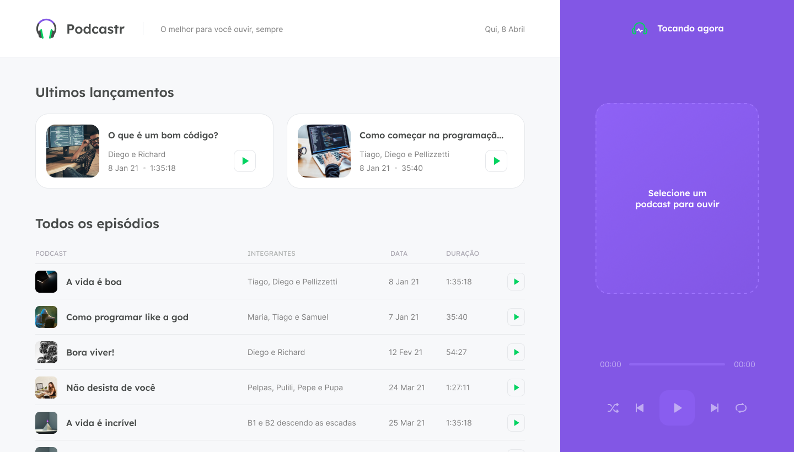
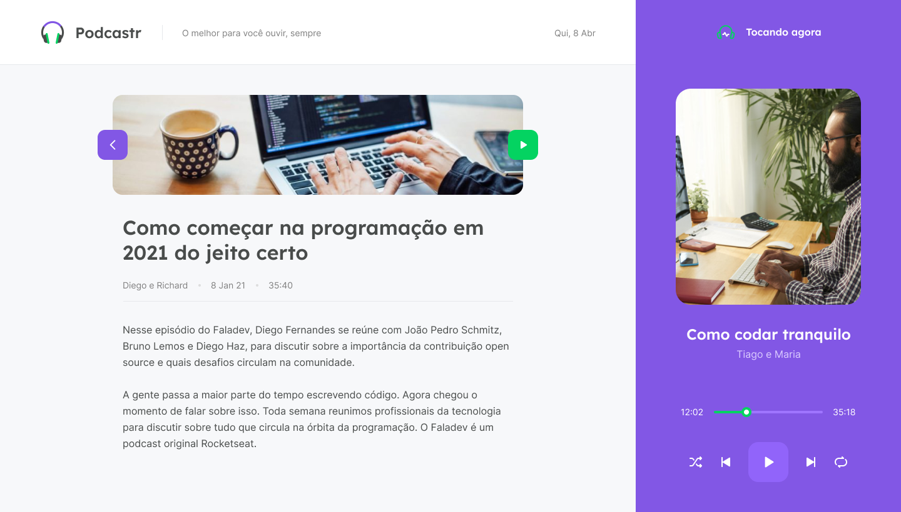

## [Read this page in English](https://github.com/ojeffpinheiro01/podcastr)

<h1 align="center">
   
</h1>  


## Menu

[Sobre o projeto](#book-sobre-o-projeto)

[Tecnologias](#rocket-tecnologias)

[Preview](#eyes-preview)

[Layout](#art-layout)

[Como rodar na sua máquina ](#fire-como-rodar-na-sua-máquina )

[Como contribuir](#gear-como-contribuir)

[Contato](#mailbox-contato)

[Siga-me ](#siga-me)

<br>
 
---

# :book: Sobre o projeto 
Podcastr é uma plataforma construída para a transmissão de podcast
Está sendo desenvolvido durante o Next Level Week # 5 - ReactJs Trail - oferecido por Rocketseat
 <h4 align="center">:construction: Em desenvolvimento da versão 2.0 :construction:</h4>
 
---

# :rocket: Tecnologias
Este projeto foi desenvolvido com as seguintes tecnologias:
- [ReactJS](https://pt-br.reactjs.org)
- [Typescript](typescriptlang.org/)
- [NextJS](https://nextjs.org)

---

# :eyes: Preview
## Web Screenshot
<div>
   
   
   
</div>

---

# :art: Layout
O Layout foi desenvolvido pelo [Tiago Luchtenberg](https://www.instagram.com/tiagoluchtenberg/), e você pode acessá-lo no [Figma](https://www.figma.com/file/UwFEntsHpHYJlHNQAQr4gA/Podcastr?node-id=160:2761)

---

# :fire: Como rodar na sua máquina 
## Precondition 
Você precisa já ter instalado
- NodeJS
- Package manager (NPM ou Yarn)
```bash
## Clone esse repositório
$ git clone https://github.com/ojeffpinheiro01/podcastr.git

## Acesse a pasta do projeto no prompt de comando 
$ cd cd podcastr

## Instale as dependências
yarn install
ou
$ npm install

## Rodando
$ yarn dev
ou
$ npm run dev
```
---

# :gear: Como contribuir
```bash
- Faça um fork desse repositório;
- Crie uma branch com a sua feature: git checkout -b minha-feature;
- Faça commit das suas alterações: git commit -m 'feat: Minha nova feature';
- Faça push para a sua branch: git push origin minha-feature;
```

---

# :mailbox: Contato	
[](https://www.linkedin.com/in/jeferson-pinheiro/)
[](mailto:jefersonpinheirodesouza@gmail.com)

---

# Siga-me 
<p align="center">
<a href="https://dev.to/ojeffoinheiro" target="blank"></a>
<a href="https://codepen.io/ojeffoinheiro" target="blank"></a>
<a href="https://linkedin.com/in/jeferson-pinheiro" target="blank"></a>
<a href="https://stackoverflow.com/ojeffpinheiro" target="blank"></a>
<a href="https://codesandbox.io/u/ojeffoinheiro" target="blank"></a>
<a href="https://app.rocketseat.com.br/me/jeferson-pinheiro-de-souza-1580117763" target="blank"></a>
</p>

---

>Este projeto foi desenvolvido com ❤️ por **[Jéferson Pinheiro](https://www.linkedin.com/in/jeferson-pinheiro/)**, com o instrutor **[Diego Fernandes](https://www.linkedin.com/in/diego-schell-fernandes/)** durante a **[Next Level Week # 5 - Trilha ReactJS](https://nextlevelweek.com/episodios/react/1/edicao/5)** da **[Rocketseat](https://rocketseat.com.br)** 💜<br> 
Se te ajudou, dá ⭐, vai me ajudar também 😉